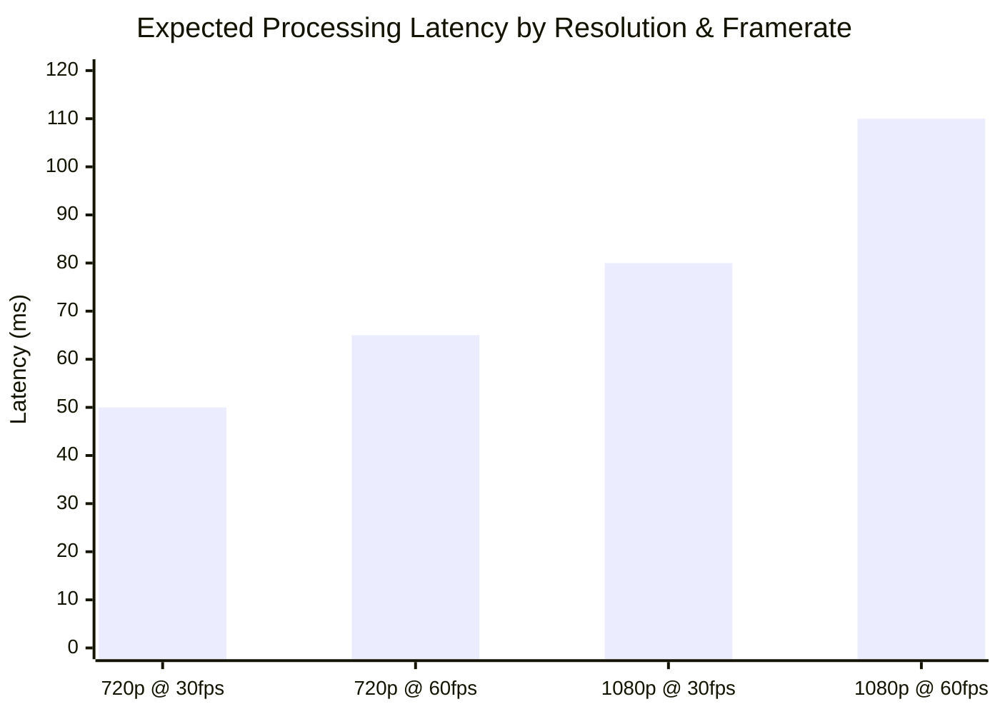
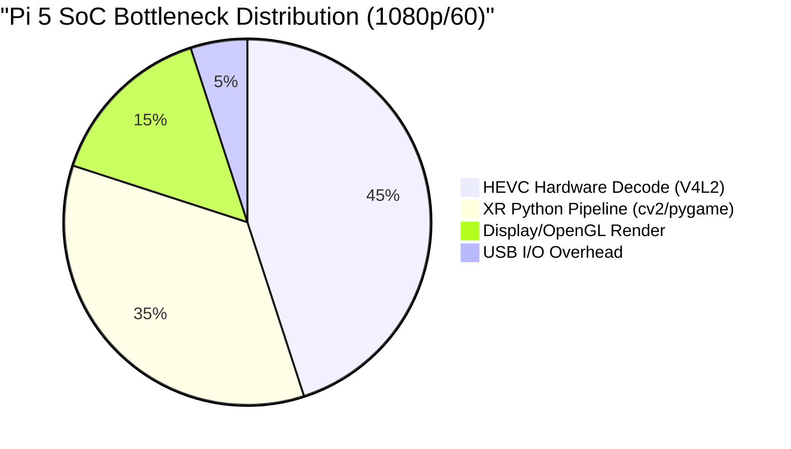

# XR Device Fusion: Latency and Codec Analysis

## 1. The 1080p 60FPS Hardware Bottleneck
When scaling the incoming smartphone feed from 720p@30fps to 1080p@60fps via `scrcpy`, the bandwidth over the USB 2.0 cable (480 Mbps max theoretical) is not the limiting factor since 24 Mbps easily fits. 

The latency spike is caused by hardware processing bottlenecks:
1. **Decode Frequency:** The Raspberry Pi 5 must handle hardware decoding (via V4L2) 60 times a second at a 1920x1080 resolution.
2. **GPU Context Switching:** The system pipeline limits (handling OpenCV tracking scripts alongside OpenGL rendering) introduce queue backlogs.
3. **Encoding Overhead:** The smartphone SoC works harder to encode 1080p at 60Hz, slightly delaying the physical packet dispatch.

### Compromise Matrix
| Config | Resolution | Framerate | Bitrate | Estimated Target Latency | Notes |
| :--- | :--- | :--- | :--- | :--- | :--- |
| **Balanced** | 1080p | 30 FPS | 8 Mbps | 80 ms | Best resolution, moderate latency. |
| **Performance** | 720p | 60 FPS | 16 Mbps | 60 ms | Best framerate, lower resolution. |
| **Ultra-Low (XR Base)** | 720p | 30 FPS | 4-8 Mbps | < 60 ms | Most stable tracking baseline. |

---

## 2. Thesis Graph Data

### Latency vs Payload Scale


### System Resource Distribution at 1080p 60FPS


---

## 3. Alternative Codecs Analysis (e.g., AV1)

**Question:** What if we used a more efficient codec to save bandwidth?

**Answer:** 
While `scrcpy` supports the **AV1** codec (`--video-codec=av1`), which boasts roughly 30% better bandwidth efficiency than H.265 (HEVC), **using it will drastically increase system latency on the Raspberry Pi 5**.

1. **Lack of Hardware Support:** The BCM2712 SoC on the Pi 5 has a dedicated hardware decoder for 4Kp60 **HEVC (H.265)**. It does not have hardware support for AV1.
2. **Software Decoding Penalty:** Forcing AV1 would fallback system processing to CPU software decoding. For a 1080p 60FPS feed, CPU software decoding would spike processor utilization, thermal throttle the Pi, and easily push latency above 150-200ms.
3. **Encoding Penalty:** Smartphones also take longer to encode AV1 frames compared to older hardware-accelerated H.265 engines, adding pre-transmission delay on the Android side.

## 4. Hardware Overhead: The Active Cooling Advantage
**Question:** Since the Pi 5 has 8GB of RAM and an Active Cooler, can we push software decoding?

**Experiment run:**
```bash
scrcpy --video-codec=av1 --video-buffer=0 --no-audio -m 1920 --max-fps=60 -b 24M
```

**Results:**
1. **Server-side (Smartphone) Encoding penalty:** Testing AV1 reveals that the system actively selects the `'c2.android.av1.encoder'` on the smartphone. `c2.android` indicates a generic Google *software* encoder, bypassing standard hardware acceleration on the phone itself, adding immediate frame dispatch latency over USB.
2. **Client-side (Pi 5) Decoding context:** Thanks to the Active Cooler and 8GB of RAM, the Pi 5's Cortex-A76 CPU doesn't thermally throttle out of the AV1 stream right away. The extra RAM isn't heavily saturated (since 0-buffering ignores queueing), but the Pi's CPU cores take the full brunt of 60FPS AV1 decoding instead of the V4L2 hardware engine. 

**Thesis Verdict on Over-provisioning:** While the Pi 5 *can* physically process AV1 dynamically thanks to active cooling preventing downclocking, the software encoder on the Android device and the CPU-bound decoder on the Pi introduce non-hardware-accelerated hops. H.265 remains superior for end-to-end silicon acceleration.
